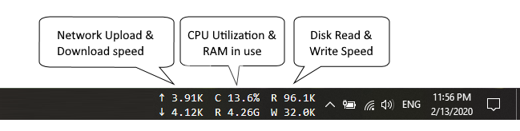
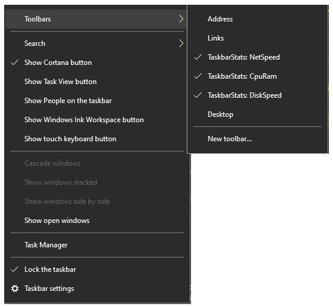

# Taskbar stats

Display live system stats on Windows's taskbar

**Note: At the first time install, you might have to right-click on the taskbar 2 times to show menu of TaskbarStats.**

## [Download](https://github.com/openhoangnc/taskbar-stats/releases)

## Donation
Eat to live, live to code

### Features

- Compact layout
- Auto choose unit to display (Byte/Kilobyte/Megabyte/...)
- Very low resource consuming
- Zero configuration/option
- Update stats every 1 second

### System requirements

- Windows 10 32bit/64bit
- [Windwos 11 is currently not compatible](https://github.com/openhoangnc/taskbar-stats/issues/31)

### [License](https://github.com/openhoangnc/taskbar-stats/blob/master/LICENSE.md)
This is free of charge software. You are allowed to:
- Private use
- Commercial use
- Distribution

### Privacy policy: [privacy-policy.md](https://github.com/openhoangnc/taskbar-stats/blob/master/Privacy-policy.md)

### Source code: N/A

I still consider about open source, at this moment you can access the reference code bellow.

### Reference code: [ref](https://github.com/openhoangnc/taskbar-stats/tree/master/ref)
